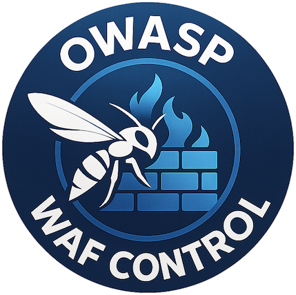

---

layout: col-sidebar
title: OWASP WAFControl
tags: owc
level: 2
type: code
pitch: OWASP WAFControl is an open-source project that provides a modern web-based interface for managing ModSecurity and the OWASP Core Rule Set (CRS).

---
**1st Modern, Web-Based GUI Dashboard for ModSecurity & OWASP CRS**

OWASP WAFControl is an open-source project that provides a modern web-based interface for managing ModSecurity and the OWASP Core Rule Set (CRS). Its primary goal is to simplify the deployment, configuration, and tuning of web application firewalls by eliminating the need for complex command-line and file-based operations. The project targets DevSecOps teams, security engineers, and system administrators who need a reliable, visual, and secure platform to manage WAF rules, monitor attacks, edit configurations, and apply updates efficiently. Future releases will introduce AI-assisted recommendations, rule analytics, alerting systems, and support for custom rule sets, making WAFControl a comprehensive and intelligent WAF management solution.

The official website of the project can be found at [https://wafcontrol.org](https://wafcontrol.org).

<!-- Toturials -->

## Licensing
OWASP OWC is free to use. It is licensed under the [Apache Software License version 2 (ASLv2)](https://www.apache.org/licenses/LICENSE-2.0), so you can copy, distribute and transmit the work, and you can adapt it, and use it commercially, but all provided that you attribute the work and if you alter, transform, or build upon this work, you may distribute the resulting work only under the same or similar license to this one. 

## Reporting Issues

* If you think you've found a false positive in commercially available software and want us to take a look, [submit an issue here](https://github.com/wafcontrol/wafcontrol/issues/new/choose) on our Github
* Have you found a false negative/bypass? See our [policy](https://github.com/wafcontrol/wafcontrol/security/policy) first on how to contact us.

## Features
The OWASP WAFControl project is already in an advanced, production-ready state. Core components such as the installation of ModSecurity, OWASP CRS, and Nginx WAF are fully operational. The system currently includes:

-A functional dashboard
-Automated WAF + CRS installer
-Live attack logging with filters and metadata
-Critical attack viewer and top attacking IP analytics
-CRS rule viewer, editor, and enable/disable toggle system
-ModSecurity settings editor
-Custom rule builder with advanced options (tags, transformations, severity, chaining, etc.)
-CRS version switching interface
-Admin profile and secure authentication (2FA-ready)

OWASP WAFControl is ready to serve as a robust open-source GUI for ModSecurity + CRS management, with a strong long-term vision for innovation in WAF usability and security intelligence.

